# Restaurant
# 🍽️ Restaurant Web Application

A **dynamic restaurant web application** using **Java, Servlet, JSP, JDBC, and MySQL** following the **MVC architecture**.

## 📌 Features
- 📝 Menu Management (View, Add, Delete Items)
- 👨‍💼 Admin Panel
- 📅 Table Booking System
- 📩 Contact Form (with database storage)
- 🔒 Secure Login System

## 🖥️ Technologies Used
- **Backend**: Java 8, Servlet, JSP, JDBC
- **Database**: MySQL 
- **Frontend**: HTML, CSS, Bootstrap, JavaScript
- **Server**: Apache Tomcat 9+

## 📂 Project Structure
```
Restaurant-WebApp/
│── src/
│   ├── com.restaurant.dao/
│   ├── com.restaurant.service/
│   ├── com.restaurant.servlet/
    ├── com.restaurant.controller/
│── webapp/
│   ├── css/
│   ├── js/
│   ├── img/
│   ├── views/
│── database.sql
│── README.md
│── screenshots/
```

## 📸 Screenshots
| Screenshot | Description |
|------------|------------|
| 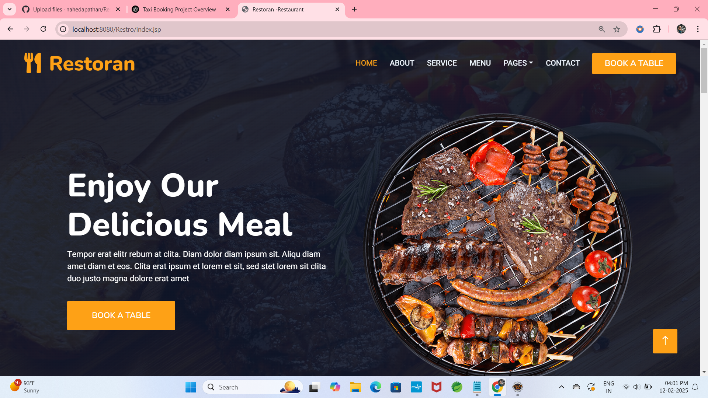 |
| 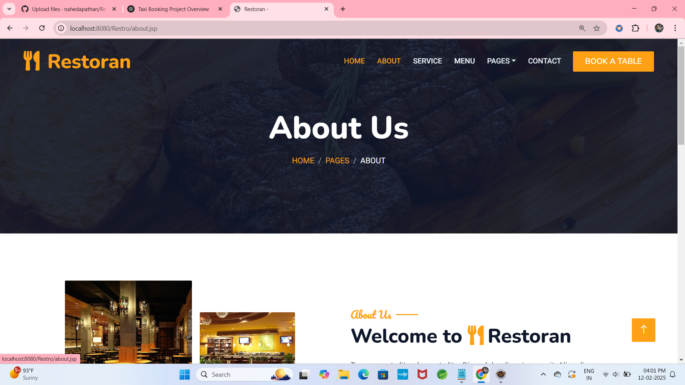 |
| 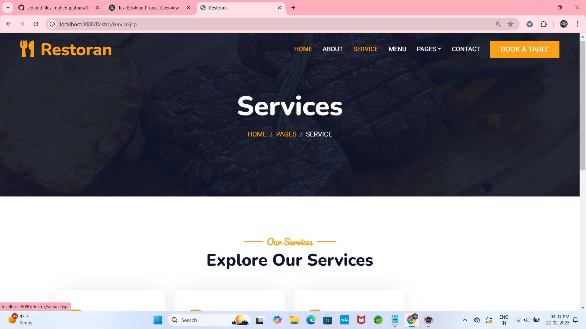 |
| 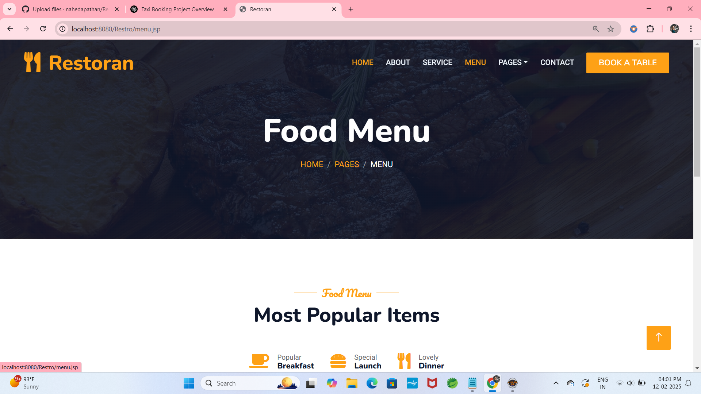 |
| 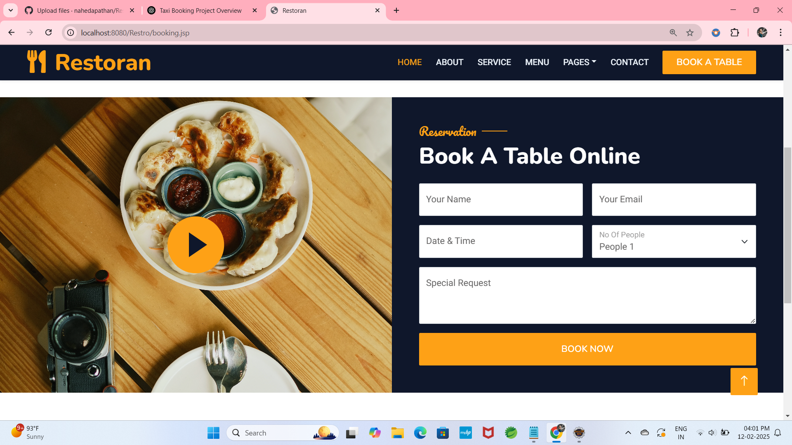 |
| 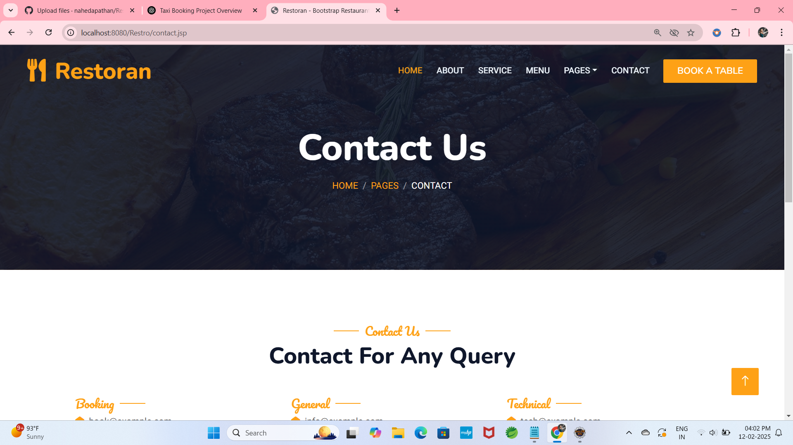 |
| 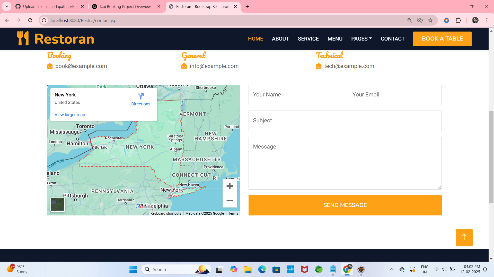 |
| 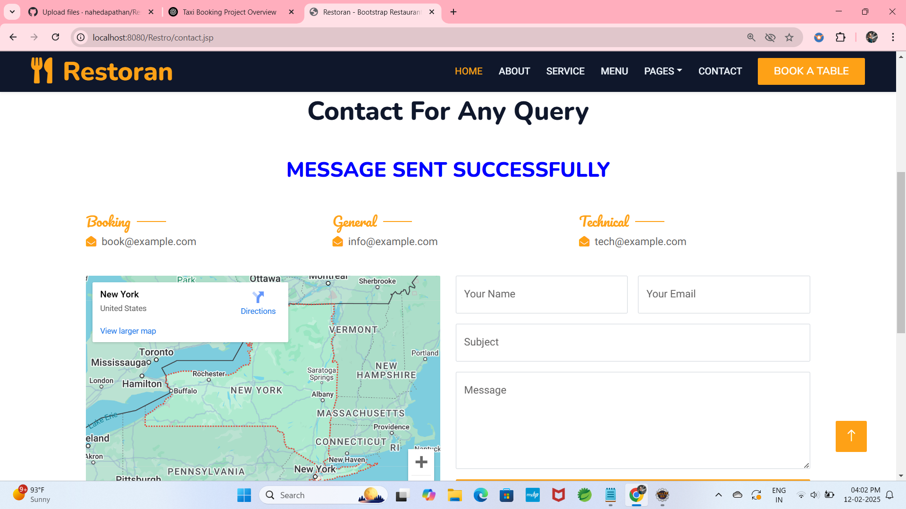 |
| 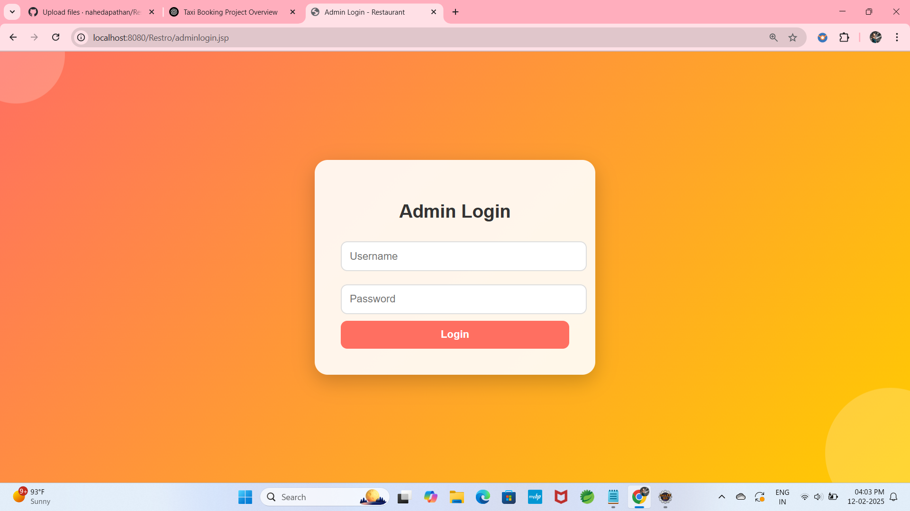 |
| 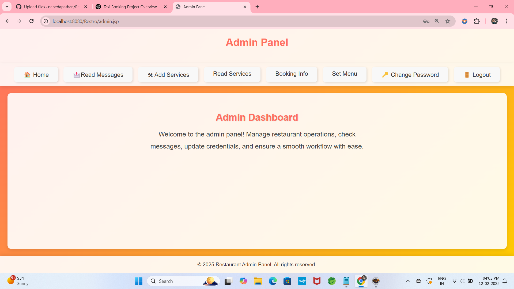 |
| 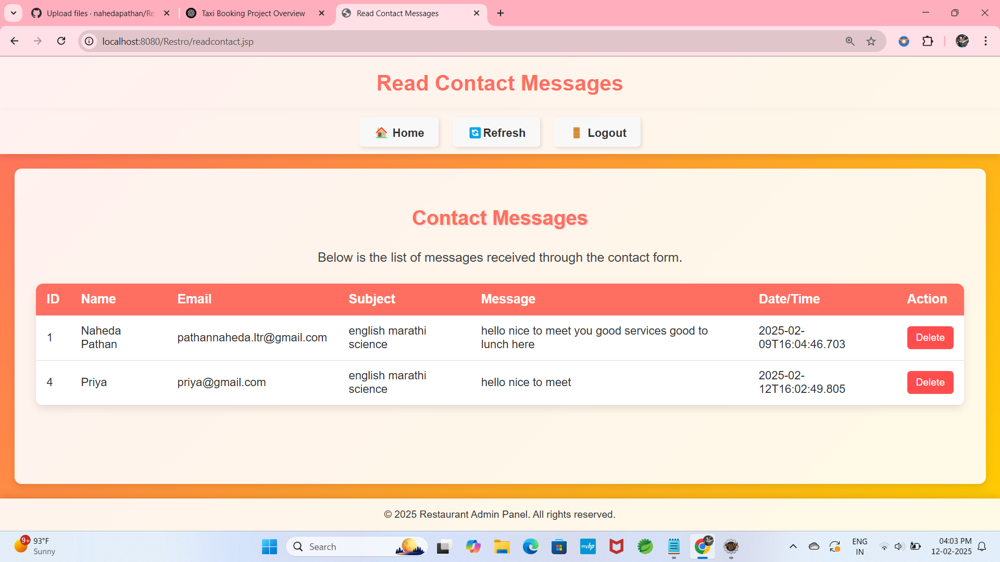 |
| 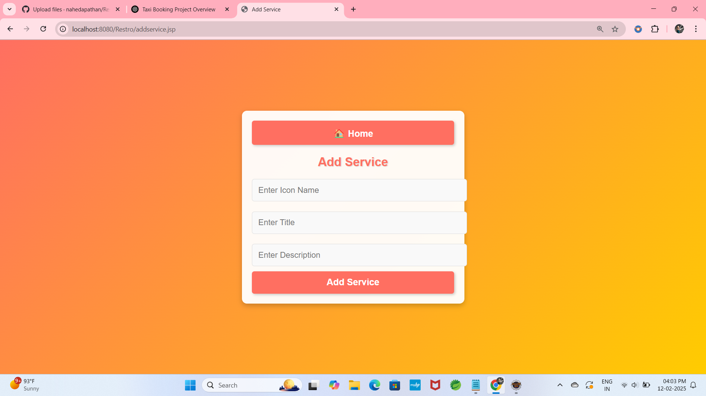 |
| 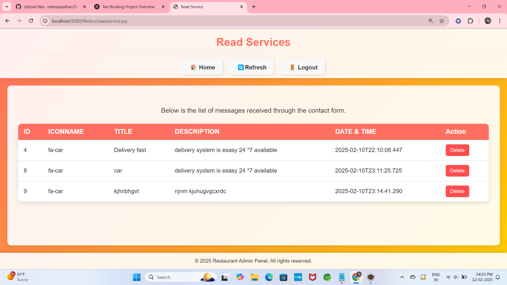 |

## 🚀 How to Run
1. Clone the repository:
   ```sh
   git clone https://github.com/nahedapathan/yourusername/Restaurant-WebApp.git
   ```
2. Import into **Eclipse/IntelliJ**.
3. Setup **MySQL database** using `database.sql`.
4. Configure **Tomcat Server**.
5. Run the application.

